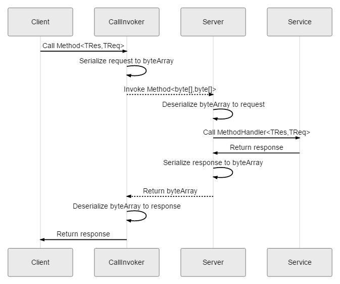
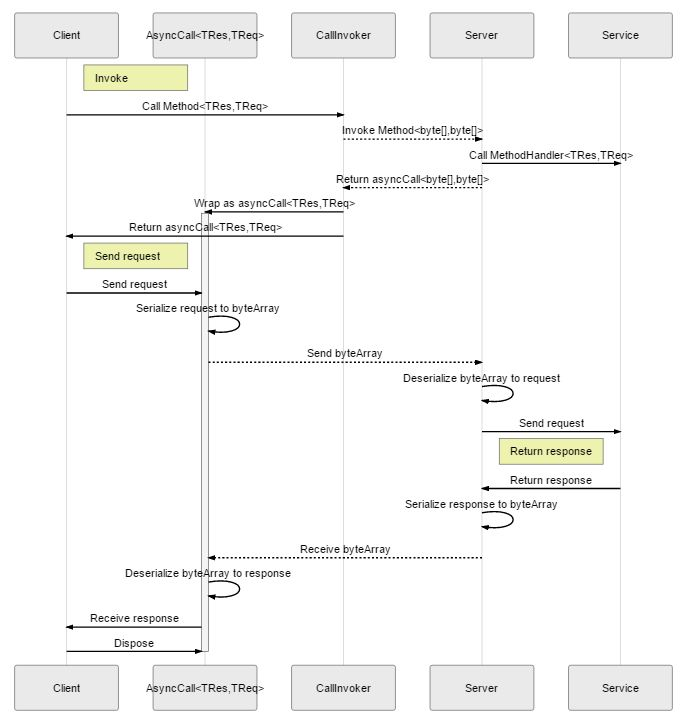

# mxProject.Helpers.GrpcCommon

gRPC common library for .NET Framework and .NET Standard.

[Japanese page](README.jp.md)

## Requrements

* .NET Framework >= 4.6
* .NET Standard >= 2.0
* Grpc.Core >= 1.19.0

## Licence

[MIT Licence](http://opensource.org/licenses/mit-license.php)


## Features

### Extension methods

* [AsyncUnaryCall](document/AsyncUnaryCallExtensions.md)
* [AsyncServerStreamingCall](document/AsyncServerStreamingCallExtensions.md)
* [AsyncClientStreamingCall](document/AsyncClientStreamingCallExtensions.md)
* [AsyncDuplexStreamingCall](document/AsyncDuplexStreamingCallExtensions.md)
* [CallOptions](document/CallOptionsExtensions.md)
* [Metadata](document/MetadataExtensions.md)
* [CallInvoker](document/CallInvokerExtensions.md)
* [ServerServiceDefinition](document/ServerServiceDefinitionExtensions.md)

### ValueType request / response

Provides a way to use value types for request / response.

RPC methods supported by `Grpc.Core` can only use reference types for request / response types. This is because type constraints are defined for request / response types.
For example, `CallInvoker.BlockingUnaryCall` method is defined as follows.

```c#
public abstract class CallInvoker
{
    public abstract TResponse BlockingUnaryCall<TRequest, TResponse> (
        Method<TRequest, TResponse> method
        , string host
        , CallOptions options
        , TRequest request
    )
        where TRequest : class
        where TResponse : class;
}
```

This library provides RPC methods without type constraints as extension methods.

```c#
public static class CallInvokerExtensions
{
    public abstract TResponse StructBlockingUnaryCall<TRequest, TResponse> (
        this CallInvoker callInvoker
        , Method<TRequest, TResponse> method
        , string host
        , CallOptions options
        , TRequest request
    );
}
```

This is achieved by serializing to a byte array before sending the request / response. The actual RPC method to be executed is `Method <byte[], byte[]>`.
For example, the sequences BlockingUnary and DuplexStreaming can be expressed as:

##### BlockingUnary Sequence




##### DuplexStreaming Sequence



### Refrection

Provides a way to get an RPC method using reflection.
* Enumerates service methods.
* Builds service definition.

It is assumed that the following service class is defined.

```c#
public sealed class TestService
{
    // Unary
    public Task<TestResponseStruct> GetResponseStruct(TestRequestStruct request, ServerCallContext context)
    {
        throw new NotImplementException();
    }
    public Task<TestResponse> GetResponse(TestRequest request, ServerCallContext context)
    {
        throw new NotImplementException();
    }

    // ClientStreaming
    public async Task<TestResponseStruct> SendRequestsStruct(IAsyncStreamReader<TestRequestStruct> requestReader, ServerCallContext context)
    {
        throw new NotImplementException();
    }
    public async Task<TestResponse> SendRequests(IAsyncStreamReader<TestRequest> requestReader, ServerCallContext context)
    {
        throw new NotImplementException();
    }

    // ServerStreaming
    public async Task ReceiveResponsesStruct(TestRequestStruct request, IServerStreamWriter<TestResponseStruct> responseWriter, ServerCallContext context)
    {
        throw new NotImplementException();
    }
    public async Task ReceiveResponses(TestRequest request, IServerStreamWriter<TestResponse> responseWriter, ServerCallContext context)
    {
        throw new NotImplementException();
    }

    // DuplexStreaming
    public async Task SendAndReceiveStruct(IAsyncStreamReader<TestRequestStruct> requestReader, IServerStreamWriter<TestResponseStruct> responseWriter, ServerCallContext context)
    {
        throw new NotImplementException();
    }
    public async Task SendAndReceive(IAsyncStreamReader<TestRequest> requestReader, IServerStreamWriter<TestResponse> responseWriter, ServerCallContext context)
    {
        throw new NotImplementException();
    }
}
```

#### Enumerate service methods

Enumerates RPC methods defined in the above class.

```c#
private void EnumerateServiceMethods()
{
    foreach (RpcMethodHandlerInfo method in RpcReflection.EnumerateServiceMethods(typeof(TestService), false))
    {
        Console.WriteLine($"[{method.MethodType}] {method.Handler.Name}<{method.RequestType.Name}, {method.ResponseType.Name}>");
    }
}
```

The following is output to the console:

```
[Unary] GetResponseStruct<TestRequestStruct, TestResponseStruct>
[Unary] GetResponse<TestRequest, TestResponse>
[ClientStreaming] SendRequestsStruct<TestRequestStruct, TestResponseStruct>
[ClientStreaming] SendRequests<TestRequest, TestResponse>
[ServerStreaming] ReceiveResponsesStruct<TestRequestStruct, TestResponseStruct>
[ServerStreaming] ReceiveResponses<TestRequest, TestResponse>
[DuplexStreaming] SendAndReceiveStruct<TestRequestStruct, TestResponseStruct>
[DuplexStreaming] SendAndReceive<TestRequest, TestResponse>
```

#### Builds service definition.

Builds a service definition in which RPC methods defined in the above class is registered.

```c#
private ServerServiceDefinition CreateService()
{
    ServerServiceDefinition.Builder builder = new ServerServiceDefinition.Builder();

    IRpcMarshallerFactory marshaller = GetMarshaller();
    string serviceName = "TestService";
    TestService serviceInstance = new TestService();

    foreach (var methodHandler in RpcReflection.EnumerateServiceMethods(typeof(TestService), false))
    {
        builder = RpcReflection.AddMethod(
            builder
            , serviceName
            , methodHandler
            , marshaller
            , serviceInstance
            );
    }

    return builder.Build();
}
```
